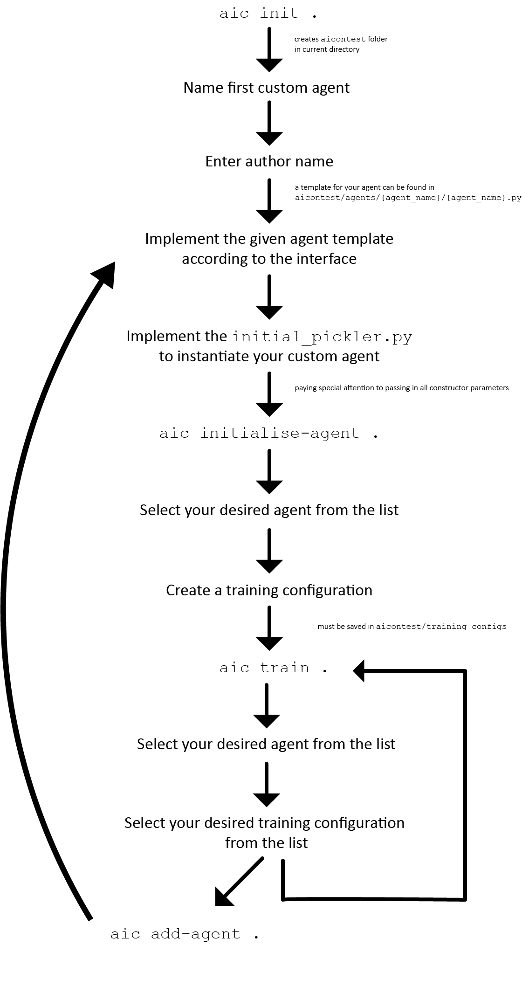

# Simulation
AI contests for deep reinforcement learning bots in online markets

## Prerequisites
Dependencies can be found in the `pyproject.toml` file.
Poetry has been set up to install all dependencies in a virtual environment.

To make use of this you should:
1. Download [poetry](https://python-poetry.org/)
2. Run `poetry install` to first install all dependencies
3. Run `poetry shell` to enter the virtual environment with access to the
   dependencies

Until the package is properly installed, we recommend setting up an alias and
running all commands from the root directory as follows:
```
alias aic="python3 src/ai_market_contest/cli/cli.py"
```

# Running the program

Here is a brief overview of the toolbox's workflow:



A more in depth explanation and tutorial can be found [here](https://github.com/AIMarketContest/simulation/blob/add-tutorial/docs/tutorial/getting_started_tutorial.md).

## Developer tools

### Styling
When in the poetry virtual environment, [black](https://black.readthedocs.io/en/stable/) should be available and can be run with `black .`.

Furthermore, it is advisable to set up a pre-commit hook with black by running the following in the poetry virtual environment:

`pre-commit install`.

